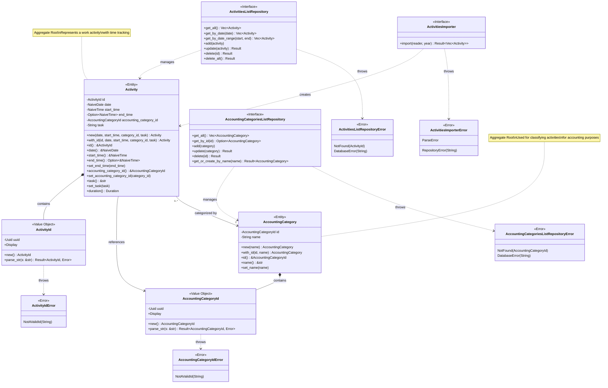
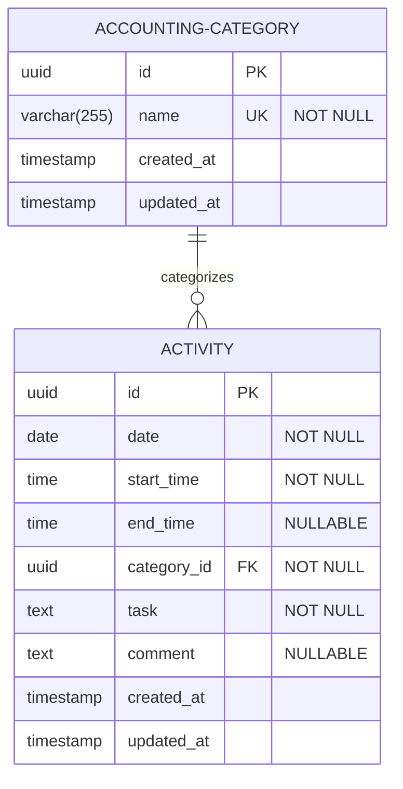
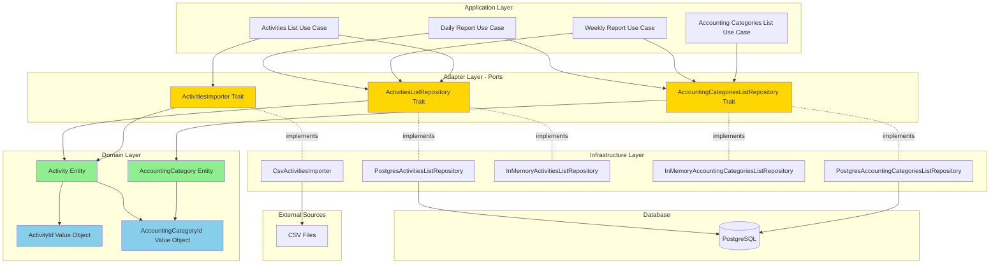
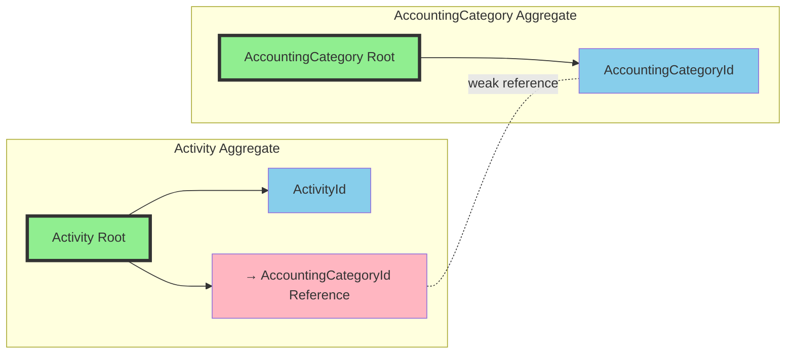
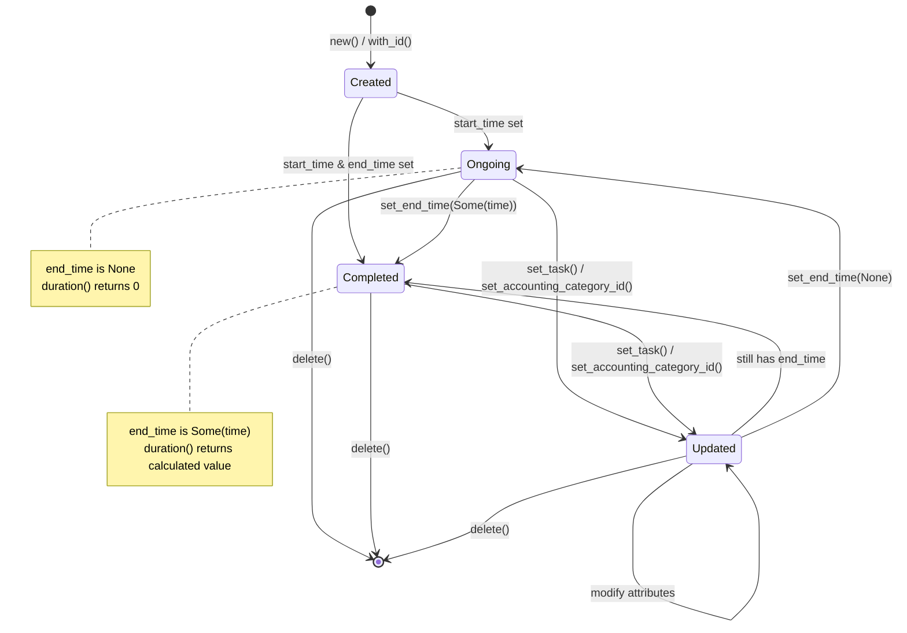

```mermaid
classDiagram
    %% Value Objects
    class ActivityId {
        <<Value Object>>
        -Uuid uuid
        +new() ActivityId
        +parse_str(s: &str) Result~ActivityId, Error~
        +Display
    }

    class AccountingCategoryId {
        <<Value Object>>
        -Uuid uuid
        +new() AccountingCategoryId
        +parse_str(s: &str) Result~AccountingCategoryId, Error~
        +Display
    }

    %% Entities
    class Activity {
        <<Entity>>
        -ActivityId id
        -NaiveDate date
        -NaiveTime start_time
        -Option~NaiveTime~ end_time
        -AccountingCategoryId accounting_category_id
        -String task
        +new(date, start_time, category_id, task) Activity
        +with_id(id, date, start_time, category_id, task) Activity
        +id() &ActivityId
        +date() &NaiveDate
        +start_time() &NaiveTime
        +end_time() Option~&NaiveTime~
        +set_end_time(end_time)
        +accounting_category_id() &AccountingCategoryId
        +set_accounting_category_id(category_id)
        +task() &str
        +set_task(task)
        +duration() Duration
    }

    class AccountingCategory {
        <<Entity>>
        -AccountingCategoryId id
        -String name
        +new(name) AccountingCategory
        +with_id(id, name) AccountingCategory
        +id() &AccountingCategoryId
        +name() &str
        +set_name(name)
    }

    %% Repository Interfaces
    class ActivitiesListRepository {
        <<Interface>>
        +get_all() Vec~Activity~
        +get_by_date(date) Vec~Activity~
        +get_by_date_range(start, end) Vec~Activity~
        +add(activity)
        +update(activity) Result
        +delete(id) Result
        +delete_all() Result
    }

    class AccountingCategoriesListRepository {
        <<Interface>>
        +get_all() Vec~AccountingCategory~
        +get_by_id(id) Option~AccountingCategory~
        +add(category)
        +update(category) Result
        +delete(id) Result
        +get_or_create_by_name(name) Result~AccountingCategory~
    }

    %% Domain Service
    class ActivitiesImporter {
        <<Interface>>
        +import(reader, year) Result~Vec~Activity~~
    }

    %% Error Types
    class ActivityIdError {
        <<Error>>
        NotAValidId(String)
    }

    class AccountingCategoryIdError {
        <<Error>>
        NotAValidId(String)
    }

    class ActivitiesListRepositoryError {
        <<Error>>
        NotFound(ActivityId)
        DatabaseError(String)
    }

    class AccountingCategoriesListRepositoryError {
        <<Error>>
        NotFound(AccountingCategoryId)
        DatabaseError(String)
    }

    class ActivitiesImporterError {
        <<Error>>
        ParseError
        RepositoryError(String)
    }

    %% Relationships
    Activity *-- ActivityId : contains
    Activity --> AccountingCategoryId : references
    AccountingCategory *-- AccountingCategoryId : contains

    ActivityId ..> ActivityIdError : throws
    AccountingCategoryId ..> AccountingCategoryIdError : throws

    ActivitiesListRepository ..> Activity : manages
    ActivitiesListRepository ..> ActivitiesListRepositoryError : throws
    
    AccountingCategoriesListRepository ..> AccountingCategory : manages
    AccountingCategoriesListRepository ..> AccountingCategoriesListRepositoryError : throws

    ActivitiesImporter ..> Activity : creates
    ActivitiesImporter ..> ActivitiesImporterError : throws

    %% Aggregate Relationship
    Activity "0..*" --> "1" AccountingCategory : categorized by

    %% Notes
    note for Activity "Aggregate Root\nRepresents a work activity\nwith time tracking"
    
    note for AccountingCategory "Aggregate Root\nUsed for classifying activities\nfor accounting purposes"
```

---

## Domain Model ER Diagram

```mermaid
erDiagram
    ACCOUNTING-CATEGORY ||--o{ ACTIVITY : "categorizes"
    
    ACCOUNTING-CATEGORY {
        uuid id PK
        varchar(255) name UK "NOT NULL"
        timestamp created_at
        timestamp updated_at
    }
    
    ACTIVITY {
        uuid id PK
        date date "NOT NULL"
        time start_time "NOT NULL"
        time end_time "NULLABLE"
        uuid category_id FK "NOT NULL"
        text task "NOT NULL"
        text comment "NULLABLE"
        timestamp created_at
        timestamp updated_at
    }
```

---

## Architecture Layers Diagram

```mermaid
graph TB
    subgraph "Application Layer"
        UC1[Daily Report Use Case]
        UC2[Weekly Report Use Case]
        UC3[Activities List Use Case]
        UC4[Accounting Categories List Use Case]
    end

    subgraph "Domain Layer"
        E1[Activity Entity]
        E2[AccountingCategory Entity]
        VO1[ActivityId Value Object]
        VO2[AccountingCategoryId Value Object]
    end

    subgraph "Adapter Layer - Ports"
        R1[ActivitiesListRepository Trait]
        R2[AccountingCategoriesListRepository Trait]
        I1[ActivitiesImporter Trait]
    end

    subgraph "Infrastructure Layer"
        PG1[PostgresActivitiesListRepository]
        PG2[PostgresAccountingCategoriesListRepository]
        MEM1[InMemoryActivitiesListRepository]
        MEM2[InMemoryAccountingCategoriesListRepository]
        CSV1[CsvActivitiesImporter]
    end

    subgraph "Database"
        DB[(PostgreSQL)]
    end

    subgraph "External Sources"
        EXT[CSV Files]
    end

    UC1 --> R1
    UC1 --> R2
    UC2 --> R1
    UC2 --> R2
    UC3 --> R1
    UC4 --> R2

    R1 -.implements.- PG1
    R1 -.implements.- MEM1
    R2 -.implements.- PG2
    R2 -.implements.- MEM2
    I1 -.implements.- CSV1

    UC3 --> I1

    E1 --> VO1
    E1 --> VO2
    E2 --> VO2

    R1 --> E1
    R2 --> E2
    I1 --> E1

    PG1 --> DB
    PG2 --> DB
    CSV1 --> EXT

    style E1 fill:#90EE90
    style E2 fill:#90EE90
    style VO1 fill:#87CEEB
    style VO2 fill:#87CEEB
    style R1 fill:#FFD700
    style R2 fill:#FFD700
    style I1 fill:#FFD700
```

---

## Aggregate Boundaries

```mermaid
graph LR
    subgraph "Activity Aggregate"
        A1[Activity Root]
        A2[ActivityId]
        A3[→ AccountingCategoryId Reference]
    end

    subgraph "AccountingCategory Aggregate"
        C1[AccountingCategory Root]
        C2[AccountingCategoryId]
    end

    A1 --> A2
    A1 --> A3
    C1 --> C2
    A3 -.weak reference.- C2

    style A1 fill:#90EE90,stroke:#333,stroke-width:4px
    style C1 fill:#90EE90,stroke:#333,stroke-width:4px
    style A2 fill:#87CEEB
    style C2 fill:#87CEEB
    style A3 fill:#FFB6C1
```

---

## State Transitions

```mermaid
stateDiagram-v2
    [*] --> Created: new() / with_id()
    
    Created --> Ongoing: start_time set
    Created --> Completed: start_time & end_time set
    
    Ongoing --> Completed: set_end_time(Some(time))
    Ongoing --> Updated: set_task() / set_accounting_category_id()
    
    Completed --> Updated: set_task() / set_accounting_category_id()
    
    Updated --> Updated: modify attributes
    Updated --> Completed: still has end_time
    Updated --> Ongoing: set_end_time(None)
    
    Ongoing --> [*]: delete()
    Completed --> [*]: delete()
    Updated --> [*]: delete()

    note right of Ongoing
        end_time is None
        duration() returns 0
    end note

    note right of Completed
        end_time is Some(time)
        duration() returns calculated value
    end note
```
